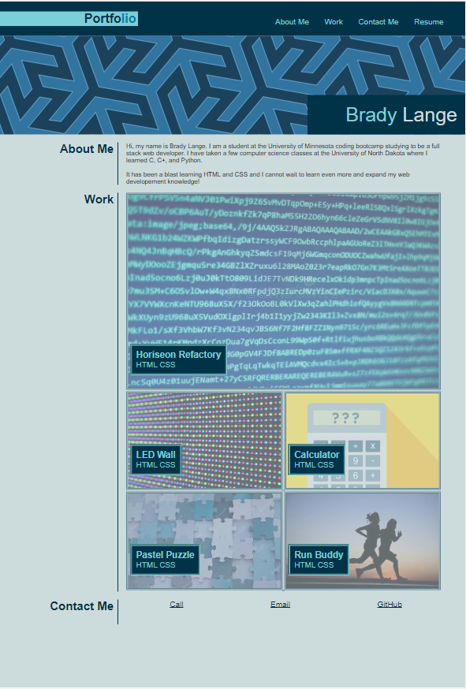

# My Portfolio

## Description
This project contains my personal portfolio. I start with an about me section where I share some of my history in coding. Then, I dislplay my work in a card based clickable fashion. Lastly, I share some of my personal information and links such as my phone#, my email, and my GitHub profile.

## Image

## Link

https://bradylange1.github.io/My-Portfolio/